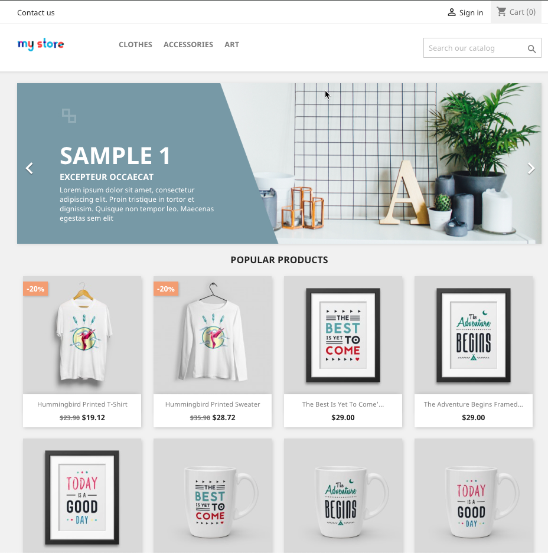

# Test Automation framework using BDD Cucumber + Java.

This repository contains a comprehensive test automation framework developed using BDD (Behavior-Driven Development)
approach with Cucumber and Java. The framework is designed to facilitate efficient and maintainable Web UI automation
testing. It incorporates various industry-standard tools and practices to showcase my skills in the field of test
automation.
It's built using:

- <strong>BDD Cucumber</strong>: The framework leverages the power of Cucumber to write test scenarios in a
  human-readable format, making it easier to collaborate with stakeholders and ensure test coverage.
- <strong>Java</strong> programing language
- <strong>Maven</strong>: The project is built and managed using Maven, enabling easy dependency management and build
  configuration.
- <strong>TestNG</strong>: The test cases are executed using the TestNG testing framework, which provides advanced
  features like parallel test execution, test grouping, and test configuration.
- <strong>POM (Page Object Model)</strong>: The framework follows the Page Object Model design pattern, promoting code
  reusability and maintainability by encapsulating page elements and their related operations in separate classes.
- <strong>Reports</strong>: Detailed HTML reports are generated after test execution, providing comprehensive insights
  into test results, including passed and failed scenarios, test coverage, and execution times.
- <strong>Jenkins</strong>: The framework can be seamlessly integrated with Jenkins, a popular continuous integration
  and continuous delivery (CI/CD) tool, allowing automated test execution and result reporting in a CI/CD pipeline.

## Scenarios to automate

<details>
  <summary>Login Tests</summary>

````
@login @regression

Feature: Test Store - Login page

  Background:
    Given I can access to test store login page

  Scenario: Validate successful login
    And I type a email "test.bd@gmail.com"
    And I type a password "12345678"
    And I click on sign in button
    Then I should be able to log in and see the name logged "Bryan Test"

  Scenario: Validate unsuccessful login
    And I type a email "test123@mail.com"
    And I type a password "password123"
    And I click on sign in button
    Then I should be able to see the "Authentication failed." error message

  Scenario Outline: Validate error messages on email text field
    And I enter a email <email>
    And I enter a password <password>
    And I click on sign in button
    Then I should be presented with the following email validation messages <loginExpectedMessage>

    Examples:

      | email | password | loginExpectedMessage                                                                                      |
      | email | test1234 | Incluye un signo "@" en la dirección de correo electrónico. La dirección "email" no incluye el signo "@". |
      |       | abc123   | Completa este campo                                                                                       |
      |       |          | Completa este campo                                                                                       |

  Scenario Outline: Validate error messages on email password field
    And I enter a email <email>
    And I enter a password <password>
    And I click on sign in button
    Then I should be presented with the following password validation messages <loginExpectedMessage>

    Examples:

      | email         | password | loginExpectedMessage                 |
      | test@test.com | 12as     | Haz coincidir el formato solicitado. |
      | test@test.com |          | Completa este campo                  |

````

</details>

<details>
<summary>Register Tests</summary>

````
@register @regression

  Feature: Test Store - Register page

    Background:
      Given I can access to test store register page


    Scenario: Validate successful account creation
      And I click on Mr radio option
      And I enter a specific firstname "TestingCR"
      And I enter a specific lastname "Bugs"
      And I enter a random email
      And I enter a specific password "bestPassword"
      And I enter a specific birthday "12/12/1970"
      And I left offers and newsletter empty
      And I click on terms and conditions checkbox
      And I click on the save button
      Then I should be able to see the name "TestingCR Bugs" logged
````

</details>


<details>
<summary>Product Tests</summary>

````
@product

Feature: Test Store - product page

  Background:
    Given I can access to store home page

  Scenario: Validate that women clothes sub-category has products available

    When I click to women clothes sub category
    Then I should be presented with at least one available listed product

  Scenario Outline: Validate that selecting available filters those will be shown in tags within active filters
    When I click to men clothes sub category
    And I select <size> size filter
    And I select <color> color filter
    Then I should be presented with <sizeFilterExpected> size filter and <sizeFilterExpected> color filter

    Examples:
      | size | color | sizeFilterExpected | sizeFilterExpected |
      | S    | White | Size: S            | Color: White       |
      | M    | Black | Size: M            | Color: Black       |
      | L    | White | Size: L            | Color: White       |
      | XL   | Black | Size: XL           | Color: Black       |

  Scenario Outline: Validate that women product is able to add to cart via quick view
    When I click to women clothes sub category
    And I select the quick view on first produc listed
    And I select <size> size option on quick view
    And I select <quantity> quantity option on quick view
    And I click on add to cart button
    Then I should be presented with the correct <sizeExpected> size, <quantityExpected> quantity and <successfulAddedMessage> message

    Examples:
      | size | quantity | sizeExpected | quantityExpected | successfulAddedMessage                           |
      | S    | 3        | S            | 3                | Product successfully added to your shopping cart |
      | M    | 2        | M            | 2                | Product successfully added to your shopping cart |
      | L    | 1        | L            | 1                | Product successfully added to your shopping cart |
      | XL   | 4        | XL           | 4                | Product successfully added to your shopping cart |


  Scenario: Validate that sorting by `Name, A to Z` the Stationery products are displayed correctly
    When I click to stationery accessories sub category
    And I choose the sort by option "Name, A to Z"
    Then I should be presented with the products listed sorted alphabetically

  Scenario: Validate that applying some Home Accessories filters reduce products quantity and after clear them they back to started quantity
    When I click to home accessories sub category
    And I click on black filter
    And I remove the filter selected
    Then I should be presented with the original products quantity

  Scenario: Validate that adding a more than 1 quantity product from Art category it'll show the correct final price on pre-checkout view
    When I click to art category
    And I select the first listed product
    And I change the quantity to 4
    And I clcik on add to cart button
    Then I should be presented with the correct quantity and price information

  Scenario: Validate that adding a more than 1 quantity product from Art category it'll show the correct final price on cart page
    When I click to art category
    And I select the first listed product
    And I change the quantity to 4
    And I clcik on add to cart button
    And I close the details information
    And I click to shopping cart button
    Then I should be presented with the correct quantity and price information

  Scenario: Validate successful product checkout
    When I click to art category
    And I select the first listed product
    And I change the quantity to 4
    And I clcik on add to cart button
    And I close the details information
    And I click to shopping cart button
    And I click on proceed to checkout button
    And I fill the personal information correctly and continue
    And I fill the address information and continue
    And I click on my carrier shipping method option and continue
    And I select the pay by check payment option
    And I click on agree to terms of service checkbox
    And I click on order with an obligation to pay button
    Then I should be able to see the confirmation message and order details correctly
````

</details>

### Web application under test

The framework is designed to automate tests for the `Test Store` web application. The application is an e-commerce
platform that offers a range of products. It provides functionalities for user authentication, product browsing,
cart management, and more.

To access the Test Store web application, visit the following URL: http://teststore.automationtesting.co.uk/



